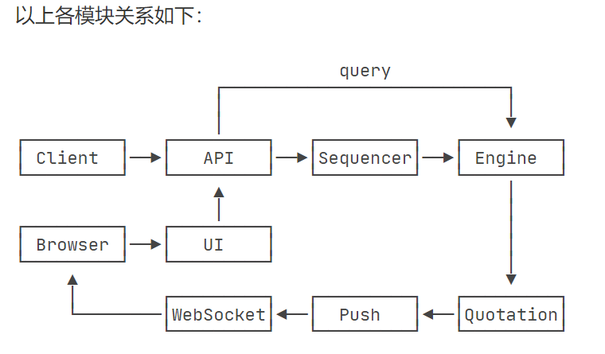
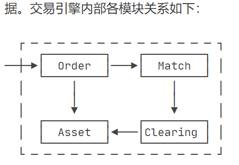

# Warp Exchange

A simple, super fast, 7x24 exchange.

### Technology

- Java 17 + SpringBoot 3.x + Spring 6.x + Maven.
- 100% in-memory trading.

### Screenshot

 
### Tutorial

[从零开始搭建一个7x24小时运行的证券交易所](https://www.liaoxuefeng.com/wiki/1252599548343744/1266263401691296)

### 交易系统逻辑概要
- 撮合和清结算系统
  - 接收订单，去对端orderBook吃单，吃不完则放在己方的orderBook
    - 吃单会导致orderBook变化
    - 吃单会导致订单状态变化。订单成交后要清结算
    - 吃单形成tick，是k线的来源
      - 一组tick形成一个时间范围内的bar[open,close,high,low,quantity]
- API和定序系统
  - 接收下单请求，往消息队列发送下单请求，同时缓存这个请求的处理结果ref
  - 对前端发送过来的下单撤单信息进行定序，保证数据持久完成且有序
- 行情和推送系统
  - tick形成bar
  - 基于Netty/Vertx的推送系统

### 定序系统
- 对于上游发来的消息，做去重、落库、生成sequenceId + previousId 处理，然后发给下游
- 定序系统宕机后，另外一个备份机器通过锁竞争，拿到工作证，开始后续的定序
  - 定序系统处理一批信息过程宕机，这批没处理完的信息，没有保存下来
  - 新工作者怎么确定从kafka哪里拉取消息？消费offset 提交了吗？

